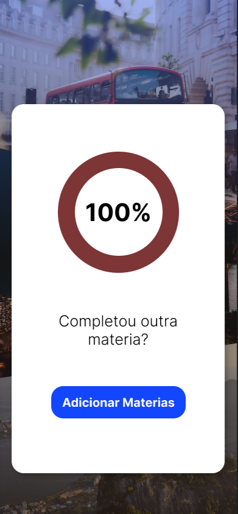
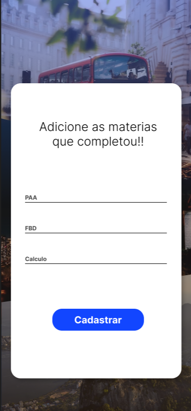
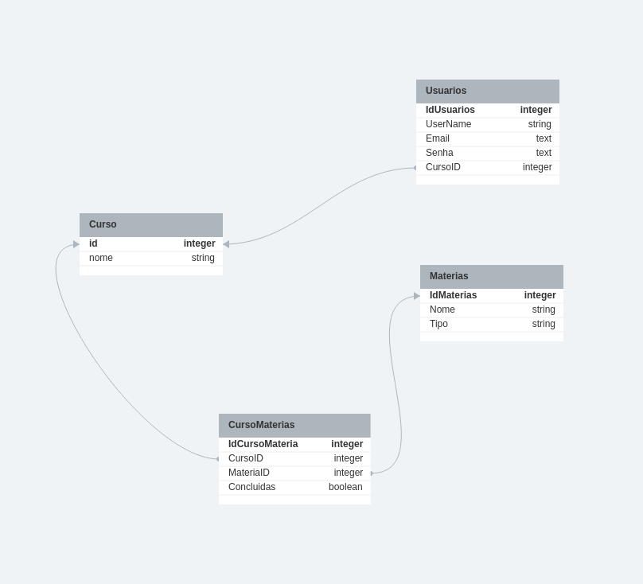

# Academia UFC

Este projeto consiste em um aplicativo Flutter desenvolvido para gerenciar o progresso das matérias cursadas na Universidade Federal do Ceará (UFC) Campus Quixadá. O objetivo é fornecer aos alunos uma ferramenta para acompanhar e visualizar o progresso em relação às disciplinas de seus respectivos cursos, além de colocar em pratica tudo o que venho estudando tanto em relação ao Flutter como a Banco de Dados.

## Cursos Disponíveis

O aplicativo contemplará os seguintes cursos:

- Engenharia de Software (ES)
- Engenharia de Computação (EC)
- Ciência da Computação (CC)
- Design Digital (DD)
- Redes de Computadores (Redes)
- Sistema da Informação (SI)

Cada curso possui sua própria grade curricular, com as disciplinas obrigatórias e optativas correspondentes. O aplicativo fornecerá uma interface intuitiva para o usuário selecionar seu curso e visualizar as disciplinas relacionadas.

## Funcionalidades

O aplicativo terá as seguintes funcionalidades:

- Visualização do progresso do aluno em relação às disciplinas obrigatórias e optativas do curso.
- Possibilidade de inserir as disciplinas optativas que o aluno está cursando.
- Exibição de um gráfico ou porcentagem que representa o progresso do aluno no curso.
- Criação de telas de protótipo para demonstrar o design e fluxo de navegação do aplicativo.

Mais funcionalidades poderão/serão adicionadas com decorrer do tempo.

## Telas de Protótipo

| Tela de Login                            | Tela de Cadastro                         |
| :--------------------------------------: | :--------------------------------------: |
|        |     |

| Tela de Progresso                        | Tela de Adição de Disciplinas            |
| :--------------------------------------: | :--------------------------------------: |
|    |  |


## Estrutura do Projeto

Para deixar o projeto mais organizado, reestruturei as pastas da seguinte maneira:
```
academia_ufc/
  |- assets/
     |- images/
         |- background.jpg
         |- facebook_logo.png
         |- google_logo.png
         |- logo_image.png
  |- lib/
     |- database/
         |- database_helper.dart
     |- screens/
         |- auth/
            |- login_screen.dart
            |- register_screen.dart
         |- home/
            |- home_screen.dart
         |- materials/
            |- add_materials.dart
     |- utils/
         |- validator.dart
     |- main.dart
  |- assets/
     |- images/
         |- logo.png
  |- README.md
```


A estrutura do projeto segue a seguinte organização:

- `assets/`: Contém os recursos estáticos do aplicativo.
   - `images/`: Contém as imagens utilizadas no projeto.
      - `background.jpg`: Imagem de fundo do aplicativo.
      - `facebook_logo.png`: Logo do Facebook.
      - `google_logo.png`: Logo do Google.
      - `logo_image.png`: Imagem do logo do aplicativo.
- `lib/`: Contém o código-fonte do aplicativo.
   - `database/`: Contém o arquivo `database_helper.dart` para lidar com o banco de dados.
   - `screens/`: Contém as telas do aplicativo.
      - `auth/`: 
         - `login_screen.dart`: Tela de login.
         - `register_screen.dart`: Tela de registro.
      - `home/`: 
         - `home_screen.dart`: Tela inicial do aplicativo.
      - `materials/`: 
         - `add_materials.dart`: Tela de adição de materiais.
   - `utils/`: Contém utilitários e helpers.
      - `validator.dart`: Arquivo contendo funções de validação.
   - `main.dart`: Arquivo principal do aplicativo.

Para utilizar essa estrutura, você pode criar as pastas e arquivos correspondentes dentro do seu projeto. Certifique-se de colocar os recursos estáticos (imagens) na pasta correta (`assets/images/`).


## Modelagem do Banco de Dados (SQLite)

O aplicativo utiliza o banco de dados SQLite para armazenar as informações das disciplinas e o progresso do aluno. A modelagem do banco de dados é composta por quatro tabelas:

### Tabelas

1. Curso

   - `id` INTEGER (Primary Key, Auto Increment)
   - `nome` TEXT

2. Materias

   - `IdMaterias` INTEGER (Primary Key, Auto Increment)
   - `Nome` TEXT
   - `Tipo` TEXT

3. CursoMaterias

   - `IdCursoMateria` INTEGER (Primary Key, Auto Increment)
   - `CursoID` INTEGER (Foreign Key referenciando Curso.id)
   - `MateriaID` INTEGER (Foreign Key referenciando Materias.IdMaterias)
   - `Concluidas` INTEGER

4. Usuarios

   - `IdUsuarios` INTEGER (Primary Key, Auto Increment)
   - `UserName` TEXT
   - `Email` TEXT
   - `Senha` TEXT
   - `CursoID` INTEGER (Foreign Key referenciando Curso.id)



## Tecnologias Utilizadas

- Flutter: Framework de desenvolvimento de aplicativos multiplataforma.
- SQLite: Banco de dados embutido utilizado para armazenar as informações das disciplinas e do progresso do aluno.
- Firebase: Possivelmente será utilizado para a autenticação e outros recursos do aplicativo.

## Como Executar o Projeto

1. Certifique-se de ter o Flutter instalado e configurado em seu ambiente de desenvolvimento.
2. Clone este repositório em sua máquina local.
3. Abra o projeto no editor de sua preferência (por exemplo, Visual Studio Code).
4. Execute o comando `flutter pub get` para instalar as dependências do projeto.
5. Conecte um dispositivo físico ou inicie um emulador.
6. Execute o comando `flutter run` para iniciar o aplicativo no dispositivo/emulador.

## Contribuição

Contribuições são bem-vindas! Sinta-se à vontade para enviar pull requests com melhorias, correções de bugs ou novas funcionalidades.
